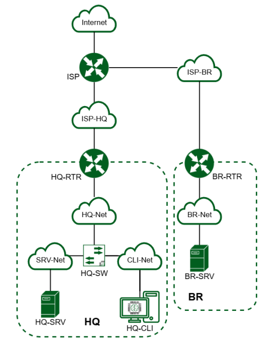
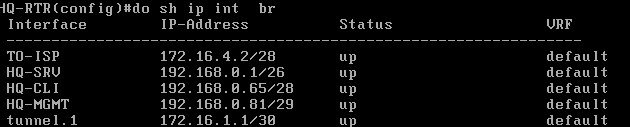

# demo2025
## 
## Модуль 1
### Распределение IP:
| Имя устройства | Интерфейс | IP          | Маска           | Шлюз        |
| -------------- | --------- | ----------  | --------------- | ----------- |
| ISP            | gi1/0/1   | DHCP        |                 |             |
|                | gi1/0/2   | 172.16.5.1  | 255.255.255.240 |             |
|                | gi1/0/3   | 172.16.4.1  | 255.255.255.240 |             |
| HQ-RTR         | ge0       | 172.16.4.2  | 255.255.255.240 | 172.16.4.1  |      
|                | ge1.100   | 192.168.0.1 | 255.255.255.192 |             |      
|                | ge1.200   | 192.168.0.65| 255.255.255.240 |             |      
|                | ge1.999   | 192.168.0.81| 255.255.255.248 |             |
|                | tunnel.1  | 172.16.1.1  | 255.255.255.252 |             |      
| BR-RTR         | ge0       | 172.16.5.2  | 255.255.255.240 | 172.16.5.1  |      
|                | te0       | 192.168.1.1 | 255.255.255.224 |             |
|                | tunnel.1  | 172.16.1.2  | 255.255.255.252 |             |
| HQ-SRV         | ens33     | 192.168.0.2 | 255.255.255.192 | 192.168.0.1 |      
| HQ-CLI         | ens192    | DHCP        | 255.255.255.240 | 192.168.0.65|      
| BR-SRV         | ens192    | 192.168.1.2 | 255.255.255.224 | 192.168.1.1 |
### Выдача имени устройству:
```
ISP - hostnamectl set-hostname ISP; exec bash
HQ-RTR - hostname HQ-RTR
BR-RTR - hostname BR-RTR
HQ-SRV - hostnamectl set-hostname HQ-SRV.au-team.irpo; exec bash
BR-SRV - hostnamectl set-hostname BR-SRV.au-team.irpo; exec bash
HQ-CLI - hostnamectl set-hostname HQ-CLI.au-team.irpo; exec bash
```
### Назначение IP:
#### ISP
Просмотр и создание директорий для интерфейсов
```
ip -c a
mkdir /etc/net/ifaces/ens**
mkdir /etc/net/ifaces/ens**
```
Создание настроек для интерфейсов
```
vim /etc/net/ifaces/ens**/options
TYPE=eth
DISABLED=no
NM_CONTROLLED=no
BOOTPROTO=static
CONFIG_IPv4=yes
выйти и сохранить изменения в vim :wq
cp /etc/net/ifaces/ens34/options /etc/net/ifaces/ens**
```
Выдача IP
```
echo 172.16.4.1/28 > /etc/net/ifaces/ens**/ipv4address
echo 172.16.5.1/28 > /etc/net/ifaces/ens**/ipv4address
```
Перезагрузка службы network
```
systemctl restart network
```
Проверка:


#### HQ-RTR
Выбор заводской прошивки на роутере, чтоб работали порты
```
en
no boot b-image active
no boot b-image stable
no boot a-image active
no boot a-image stable
перезагружаем машину
```
```
Включение - en
Вход в конфигурационный режим - conf t
Просмотр портов - do sh port br
```
```
Создание интерфейса и назначение ему IP
int TO-ISP
ip address 172.16.4.2/28
no shutdown
ex
```
Привязка созданного интерфейса к порту
```
port ge0
service-instance ge0
encapsulation default
ex
service-instance SI-ISP
encapsulation untagged
connect ip interface TO-ISP
```
Создание интерфейсов для VLAN
```
interface HQ-SRV
 ip mtu 1500
 ip address 192.168.0.1/26
!
interface HQ-CLI
 ip mtu 1500
 ip address 192.168.0.65/28
!
interface HQ-MGMT
 ip mtu 1500
 ip address 192.168.0.81/29
!
```
Создание для каждого VLAN своего service-instance
```
port te0
 mtu 9234
 service-instance te0/vlan100
  encapsulation dot1q 100
  rewrite pop 1
  connect ip interface HQ-SRV
 service-instance te0/vlan200
  encapsulation dot1q 200
  rewrite pop 1
  connect ip interface HQ-CLI
 service-instance te0/vlan999
  encapsulation dot1q 999
  rewrite pop 1
  connect ip interface HQ-MGMT
do wr
```
Создание GRE тоннеля
```
interface tunnel.1
 ip mtu 1400
 ip address 172.16.1.1/30
 ip tunnel 172.16.4.2 172.16.5.2 mode gre
```
Маршрут в сторону ISP
```
ip route 0.0.0.0/0 172.16.4.1
do wr
```
Проверка:


#### HQ-SRV
Просмотр интерфейсов
```
ip -c a
```
Создание настроек интерфейсов
```
vim /etc/net/ifaces/ens**/options
TYPE=eth
DISABLED=no
NM_CONTROLLED=no
BOOTPROTO=static
CONFIG_IPv4=yes
выйти и сохранить изменения в vim :wq
```
Выдача IP
```
echo 192.168.0.2/26 > /etc/net/ifaces/ens**/ipv4address
```
Выдача шлюза
```
echo default via 192.168.0.1 > /etc/net/ifaces/ens**/ipv4route
```
Перезагрузка службы network
```
systemctl restart network
```
