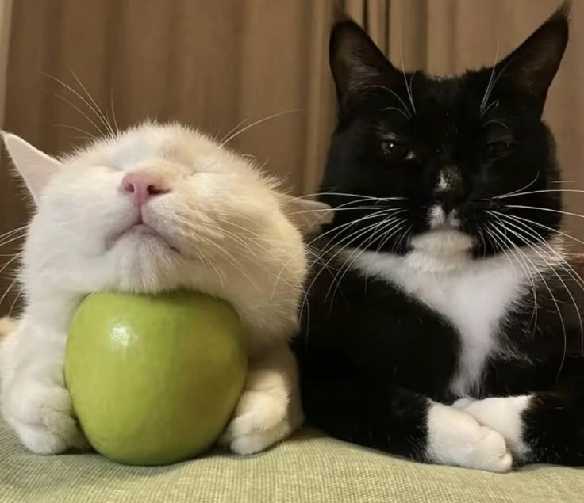

# demo2025
### Решение модулей

**[Модуль 1](https://github.com/PIZDEC-DEMO/demo2025/tree/main/module1)**

**[Модуль 2](https://github.com/PIZDEC-DEMO/demo2025/tree/main/module2)**



#### Немного анекдотов

```
Змея споткнулась
```
```
Идет медведь по лесу, видит машина горит, сел в нее и сгорел
```
```
Идут два сис.админа один с ноутом, второй тоже пизды получит
```
```
Девочка больная раком играла в покер, у нее выпало каре
```
```
— Василий Иваныч, а что такое эмпирический опыт?
— Вот ты, Петька, знаешь, что такое нюанс?
— Знаю, Василий Иваныч, не надо больше!
— Вот это и есть эмпирический опыт.
```
```
Едет генеральская машина. За рулём водитель – на заднем сидении шлюха лёгкого поведения делает генералу минет. Гаишник по своему недоумию останавливает. Заднее стекло опускается (девушка продолжает).
Гаишник:
— Извините, товарищ генерал, виноват, не узнал.
— Да ничего, благодарю за службу. Не побоялся. Чем же тебя отблагодарить, поощрить...

Взгляд переводит на голову тёлки и вдруг спрашивает:
— Будешь?
Инспектор краснея:
— Да я после неё брезгую!
```
```
Игра - Что? Где? Когда? Ведущий: 
— Господин Поташов представте - вы идете с господином Друзем. Его неожиданно кусает кобра в член. 
Внимание вопрос: что необходимо сделать чтоб спасти Друзя? 
Минута прошла... пииии... 
И так господа кто будет отвечать? Поташов: 
—Я отвечу, господин ведущий. Я считаю что необходимо отсосать яд из члена господина Друзя. 
— Ответ принят. Внимание правильный ответ: Господа. Всем известно что кобра никогда ни кусает выше колена. Поэтому если змея укусила господина Дру...
— Крюк, ты сдурел что-ли? Тебе там Пикабу провели в кабинку? Этому приколу лет десять
— С хуесосами не разговариваю. 1:0 НЕ в пользу хуесосов хахахах
```
```
Стоят два барана в поле. Один говорит:
- Беееее
А второй отвечает:
- Бля, то же самое хотел сказать
```
```
В автобусе едет старушка, рядом стоит панк. Старушка громко чихает.
– Бабушка, будьте здоровы - говорит панк.
– Ой, милок, спасибо!
– Во-первых, не милок, а чел. Во-вторых, не спасибо, а кайфули. В третьих, не ой, а бля. Поняла?
– Поняла, сынок.
Через некоторое время опять чихает. Рядом стоящий мент говорит:
– Будьте здоровы, бабушка.
– Бля, чел, кайфули!
– Хайпуешь, плесень?
```
```
Купил мужик шляпу, а она ему как раз.
```
```
Штирлиц почувствовал спиной, что приближается смертоносный свинец. Он успел отпрыгнуть, смертоносный свинец со свистом и хрюканьем промчался мимо.
```
```
Почему черный ребенок заплакал, когда ему попали снежком в лицо?
Он понял что это не навсегда.
```
```
Анимешник, проходя мимо гей-бара, обращается сам к себе: 
— А ну-ка, друг, есть ли у тебя сила воли, чтобы пройти мимо? 
— Есть! — отвечает он сам себе и твердо идёт вперед. Через десять метров останавливается. 
— Молодец! Есть у тебя сила воли! — говорит он и возвращается назад, расстёгивая штаны.
```
